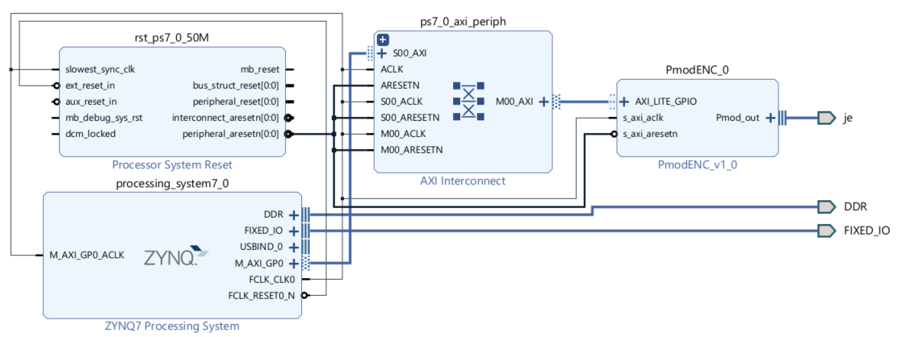

# Baremetal C Application for Displaying Encoder Values on Serial Interface

## Overview
This project involves creating a baremetal C application that reads encoder values from Digilent PmodENC module and displays them on a serial interface. The system uses a Zynq-7000 SoC with a hardware design configured in Vivado and the application developed in Vitis.

### Block Design
The hardware design includes:
- **ZYNQ7 Processing System**: Manages the overall operation and interfaces with the encoder.
- **Processor System Reset**: Ensures the system starts in a known state.
- **AXI Interconnect**: Facilitates communication between the processing system and peripherals.
- **PmodENC**: Official xilinx ip, connected via AXI Lite GPIO for reading encoder values.

## How to Use

### Prerequisites
- Xilinx Vivado Design Suite
- Xilinx Vitis Unified Software Platform
- Serial terminal application (e.g., Tera Term, PuTTY)

### Vivado Project
The Vivado project is available in the `/Vivado_Zynq_ENC` directory. It includes all necessary configurations and the bitstream file for FPGA programming.

### Vitis Application
The Vitis application is available in the `/Vitis_workspace` directory. It contains the source code (application and platform)
